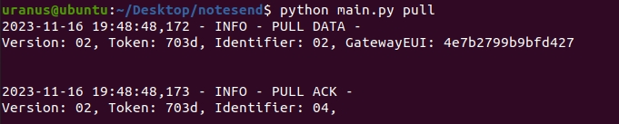
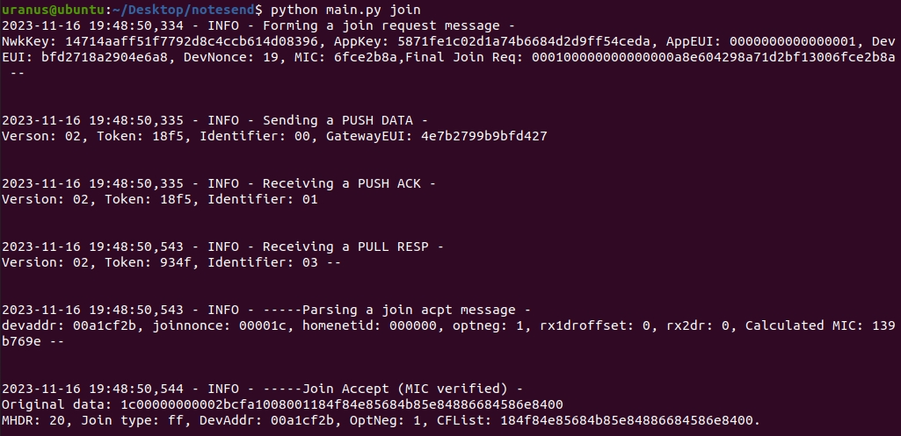
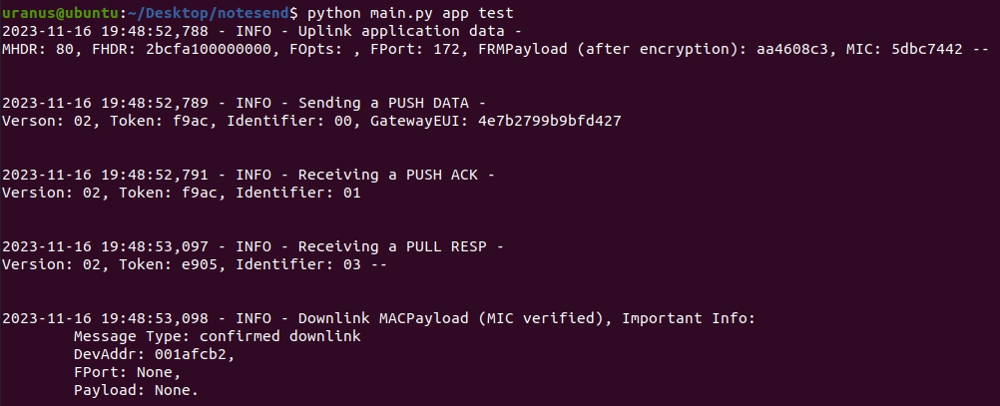
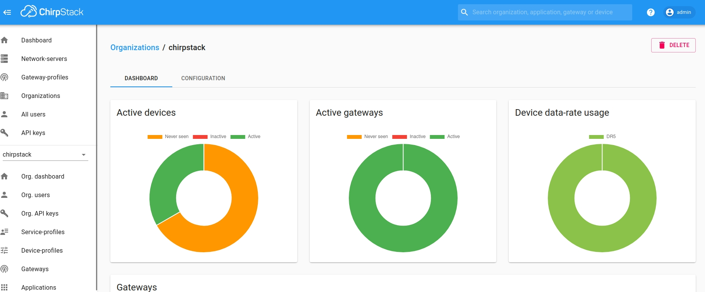
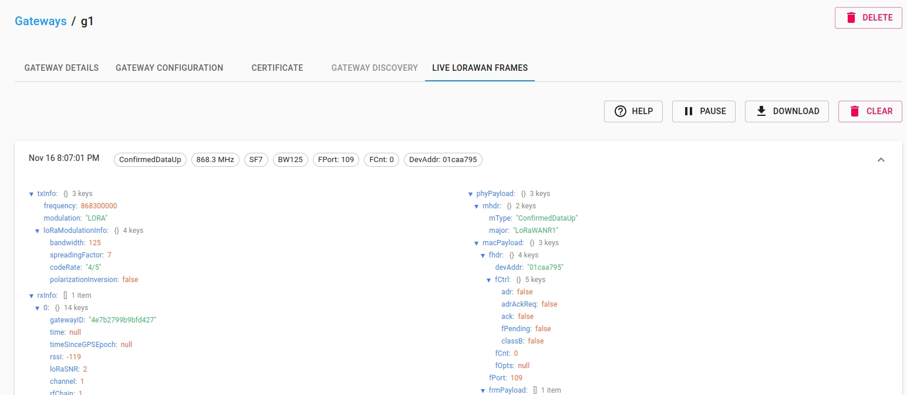
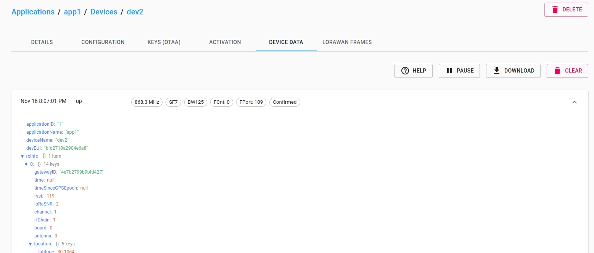
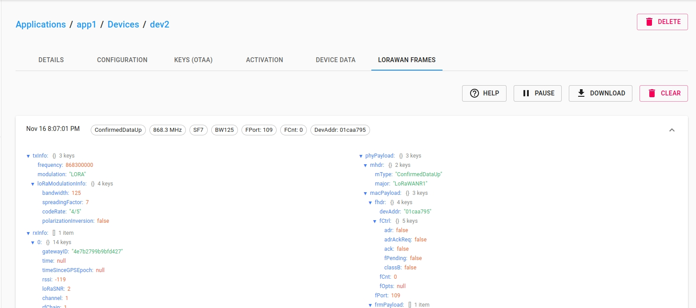
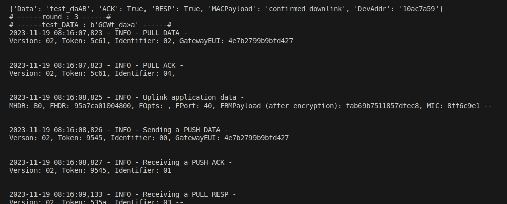

lorawan_note_send
=================

* [lorawan_note_send](#lorawan_note_send)
* [Introduction](#introduction)
   * [Setup](#setup)
      * [Working configuration](#working-configuration)
      * [config](#config)
   * [Steps](#steps)
      * [1. Pull_data](#1-pull_data)
      * [2. Join_request](#2-join_request)
      * [3. Send_data](#3-send_data)
      * [4. Results](#4-results)
      * [5. Fuzzingtest](#5-fuzzingtest)


# Introduction

This project mainly simulates a gateway and devices in a LoRaWAN network communication environment, with ChirpStack serving as the network server. A local UDP client is used to handle communication with the ChirpStack network.

## Setup
### Working configuration
Ubuntu 20.04 LTS
Python 3.8

### config
/config

+ config.json: Basic configurations.
+ gateway.json: Gateway EUI.
+ device.json: Device parameters for OTAA mode.

<strong>（These have to be the same as the information related to the devices registered inside ChirpStack）</strong>

OTAA
Modify device infomation in config/device.json. An example:

```
{
    "Device": {
        "JoinEUI": "0000000000000001",
        "DevEUI": "bfd2718a2904e6a8"
    },
    "RootKeys": {
        "AppKey": "5871FE1C02D1A74B6684D2D9FF54CEDA",
        "NwkKey": "14714AAFF51F7792D8C4CCB614D08396"
    }
}
```

Gateway

Modify Gateway infomation in config/gateway.json. An example:

```
{"GatewayEUI": "4e7b2799b9bfd427"}
```

## Steps

The general workflow is as follows:

1. Send a PULL_DATA to ChirpStack server by <strong>python main.py pull</strong>.
2. Send a join request message to ChirpStack server by <strong>python main.py join</strong>.
3. If the join accept message is decoded successfully, we can send an uplink message.
4. An Uplink message can be sent by <strong>python main.py app -m xxxxx</strong>.

### 1. Pull_data
python main.py pull




### 2. Join_request
python main.py join -n / python main.py join




### 3. Send_data
python main.py app test




### 4. Results









### 5. Fuzzingtest

Currently, only the mutation construction of data sent to the Device has been implemented.

python main.py fuzz testdata



Results: Fuzzed_results.csv
